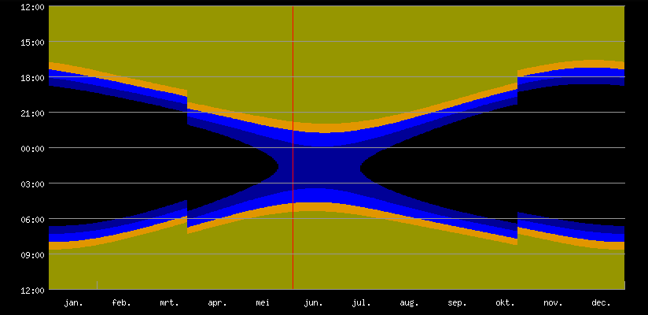
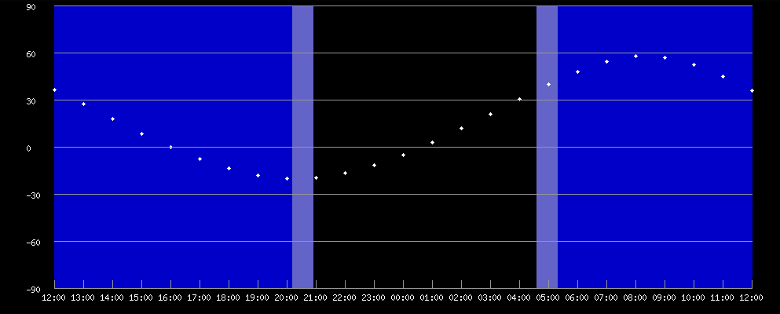
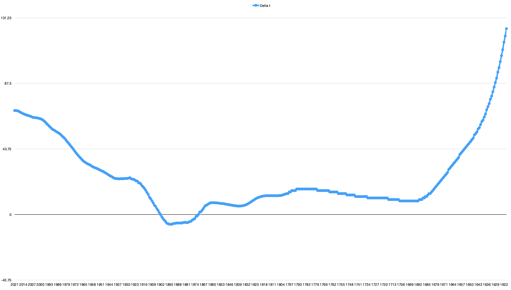

# Changelog

All notable changes to `laravel-astronomy-library` will be documented in this file.

## Version 4.26

### Changed

- Changed:
  - AstronomyLibrary now also keeps deltaT, so that we don't have to recalculate or read it from the database again and again.
  - The calculation of deltaT will now also work when no database is configured.

## Version 4.25

### Added

- Added:
  - Methods to calculate the date of the ascending and descending node of targets in ellipical and parabolic orbits.

## Version 4.24

### Added

- Added:
  - Calculation of aphelion and perihelion date for the planets.

## Version 4.23.1

### Fixed

- Fixed:
    - Fix calculation of delta T in the beginning of the year if the new value is not yet available in the database.

## Version 4.23

### Added

- Added:
  - Calculation of inferior / superior conjunction for inner planets
  - Opposition / conjuntion of outer planets
  - Greatest eastern and western elongation of inner planets.

## Version 4.22

### Added

- Added NearParabolic class, describing an object moving in a near-parabolic orbit. Added method to calculate the coordinates.

## Version 4.21

### Added

- Added Parabolic class, describing an object moving in a parabolic orbit. Added method to calculate the coordinates.

## Version 4.20

### Added

- Added methods to calculate the contrast reserve and the magnification of an object. The contrast reserve tells how easy it is to detect an object.
- If the contrast difference is < 0, the object is not visible, contrast difference < -0.2 : Not visible, -0.2 < contrast diff < 0.1 : questionable, 0.10 < contrast diff < 0.35 : Difficult, 0.35 < contrast diff < 0.5 : Quite difficult to see, 0.50 < contr diff < 1.0 : Easy to see, 1.00 < contrast diff : Very easy to see

## Version 4.19.1

### Changed

- Obliquity is not needed as parameter in the calculateEquatorialCoordinates method of Planet and Elliptic

## Version 4.19

### Added

- Added methods to calculate the Equatorial coordinates of the planets for a given date.
- Added Elliptic class, describing an object moving in an elliptic orbit. An add method to calculate the coordinates.

## Version 4.18

### Added

- Added methods to calculate the Heliocentric coordinates of the planets for a given date.

## Version 4.17

### Added

- Added classes for the planets:
  - Mercury, Venus, Earth, Mars, Jupiter, Saturn, Uranus, Neptune
- Added methods to calculate the mean orbital parameters of the planets for a given date.

## Version 4.16

### Added

- Added method to calculate the eccentric anomaly using the equation of Kepler
  - Target::eccentricAnomaly()
## Version 4.15

### Added

- Added method to calculate the ephemeris for physical observations of the sun
  - Sun::getPhysicalEphemeris()

## Version 4.14

### Added

- Added method to calculate the equation of time
- Added methods to print the coordinates without seconds:
  - convertToShortHours()
  - convertToShortDegrees()

## Version 4.13

### Added

- Added methods to get the start of the seasons:
  - Time::getWinter()
  - Time::getSpring()
  - Time::getSummer()
  - Time::getAutumn()

## Version 4.12

### Added

- Add method to calculate the rectangular coordinates of the sun
- Add RectangularCoordinates class

## Version 4.11

### Added

- Add method to calculate the atlas page corresponding to equatorial coordinates.

## Version 4.10

### Added

- Add method to calculate the constellation when the coordinates are given.  The constellation is returned as 3 characters (Latin name).  The migration should be re-exported and run to be able to run this method.

## Version 4.9.3

### Changed

- Fix the calculation of the altitude graph if the equatorial coordinates of yesterday and tomorrow are also given.

## Version 4.9.2

### Changed

- Add the equatorial coordinates of yesterday and tomorrow to the target (sun).

## Version 4.9.1

### Changed

- Use \Carbon\Carbon everywhere in the code

## Version 4.9

### Added

- Add methods to calculate the equatorial coordinates of the sun.

## Version 4.8

### Added

- Add methods to calculate the apparent place of a star, using the Ron-Vondrák expression. The calculations take into account the perturbations caused by the planets, the precession and the nutation.

## Version 4.7

### Added

- Add precession method for EquatorialCoordinates to calculate the precession for a given date with low accuracy.  The proper motion of the star is taken into account for the calculation of the precession.
- Add precessionHighAccuracy for EquatorialCoordinates method to calculate the precession for a given date with high accuracy.  The proper motion of the star is taken into account for the calculation of the precession.
- Add precessionHighAccuracy for EclipticalCoordinates method to calculate the precession for a given date with high accuracy.  The proper motion of the star is not taken into account for the calculation of the precession.

### Changed

- The constructor of the EquatorialCoordinates class now also takes the epoch of the coordinate as argument.  If the epoch is not given, the standard epoch of 2000.0 is taken.
- The constructor of the EquatorialCoordinates class now also takes the proper motion (in RA and in dec) as arguments.  If the proper motion is not given, the value of 0.0 is taken.

## Version 4.6

### Added

- Added methods to calculate the smallest circle containing three celestial bodies.

## Version 4.5

### Added

- Added methods to check if three bodies are in a straight line and to calculate the deviation from a straight line.

## Version 4.4

### Added

- Added methods to calculate the angular separation between two objects.

## Version 4.3

### Added

- Added methods to calculate the refraction for given horizontal coordinates.

## Version 4.2

### Added

- Added view with the length of the night at a given location.

## Version 4.1

### Added

- Added view with the altitude of the target during the night.

## Version 4.0.1

### Changed

- Corrected convertToDegrees method on Coordinates to return h m s, instead of h ' ".
- Added getCoordinates method on Target.

## Version 4.0

### Changed

- Removed abstract Coordinates class.
- Added Coordinate class and reworked all Coordinate Classes to use this new class.

### Added

- Calculation of rising, transit and setting for targets.
- Calculation of best time to observe a target.
- Calculation of highest altitude of a target.
- Added classes for Targets, Moon, Sun, and Planet.

## Version 3.1

### Added

- Calculation of parallactic angle.

## Version 3.0

### Changed

- GeographicalCoordinates class now inherits from the abstract Coordinates class.
- Moved GeographicalCoordinates to deepskylog\AstronomyLibrary\Coordinates.
- The method apparentSiderialTime of the Time class can take an extra parameter nutation.

### Added

- Added abstract Coordinates class.
- Added EquatorialCoordinates, EclipticalCoordinates, Horizontal and GalacticCoordinates classes.
- Added conversion between the Coordinates classes.

## Version 2.0.1

- Bump minimum php version to 7.4.
- Bump minimum laravel version to 7.0.

## Version 2.0

### Changed

- The constructor of AstronomyLibrary now needs the geographical coordinates as parameter.

### Added

- Added methods to calculate the dynamical time.
- Added methods to calculate the mean and apparent siderial time at the given location.
- Added methods to calculate the nutation for a given date.
- Added GeographicalCoordinates class.

## Version 1.1

### Fixed

- Fixed conversion from SQM to NELM and back.

### Added

- More [documentation](docs/docs.md) on the mathematical background of the used formulae.
- Methods to calculate dynamical time.
  - The list of delta t values from 1620 to 2011 is taken from the webpage of [R.H. van Gent](https://www.staff.science.uu.nl/~gent0113/deltat/deltat.htm)
  - The values from 2011 onward are taken from the VVS mailing list, provided by Jean Meeus.
  - This is the graph with the delta t values from 1620 to today:

  - A new table delta_t is added to the database, and a cronjob to update the table every day / week / month is added to the scheduler.

## Version 1.0

### Added

- Methods to convert from Carbon dates to julian date
- Methods to convert between NELM, SQM and bortle
