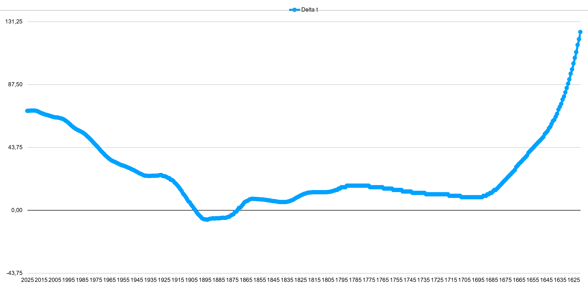

# Laravel-astronomy-library documentation

Most of the calculations are from the formulae in Astronomical Algorithms by Jean Meeus.

## Time

### Julian day

The standard calculations in php to calculate the julian day do not take into account the time of the day. Moreover, the php calculation do not take care of the fact that the julian day starts at noon.  To overcome these problems, we reimplemented the calculations of the julian day using the formulae in Astronomical Algorithms by Jean Meeus.

### Delta t

- The list of delta t values from 1620 to 2011 is taken from the webpage of [R.H. van Gent](https://www.staff.science.uu.nl/~gent0113/deltat/deltat.htm)
- The values from 2011 onward are taken from the VVS mailing list, provided by Jean Meeus.
- This is the graph with the delta t values from 1620 to today:

- The formulae for the years that are not tabulated, are taken from the [NASA Eclipse Website](https://eclipse.gsfc.nasa.gov/SEcat5/deltatpoly.html)

### Nutation

- The array that is returned from the calculation of the nutation (Time::nutation(jd)) contains the following information:
  - nutation in Longitude
  - nutation in Obliquity
  - mean Obliquity
  - true Obliquity

## Magnitude

### Conversion between NELM, SQM and Bortle Scale

The formulae to convert between NELM and SQM are taken from the Telescope Limiting Magnitude article by [Schaefer, 1990](http://adsbit.harvard.edu/cgi-bin/nph-iarticle_query?bibcode=1990PASP..102..212S).
