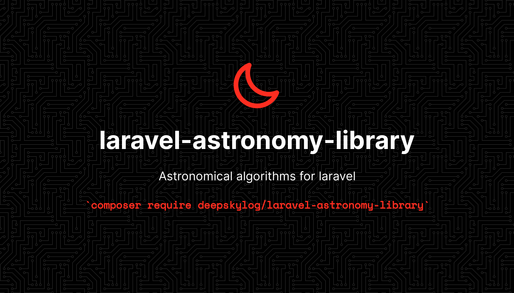

[](https://www.deepskylog.org/)

[![Latest Version on Packagist][ico-version]][link-packagist]
[![Total Downloads][ico-downloads]][link-downloads]
[![Build Status][ico-travis]][link-travis]
[![StyleCI][ico-styleci]][link-styleci]

Take a look at [contributing.md](contributing.md) if you are interesting in helping out.
The laravel-astronomy-library is part of [DeepskyLog](https://www.deepskylog.org). If you are interested in helping with the development of DeepskyLog, see the [documentation](https://github.com/DeepskyLog/DeepskyLog/blob/laravel/README.md).

## Installation

AstronomyLibrary can be installed via composer.  laravel-astronomy-library needs at least php 7.4 to run.

``` bash
composer require deepskylog/laravel-astronomy-library
```

You need to publish and run the migration:

``` bash
php artisan vendor:publish --provider="deepskylog\AstronomyLibrary\AstronomyLibraryServiceProvider" --tag="migrations"
php artisan migrate
```

The database table with the delta t values can be updated using the following command:

``` bash
php artisan deltat:update
```

A job is automatically scheduled every 4 months to update the delta t value. This job can be executed using:

``` bash
php artisan schedule:run
```

It is possible to run these jobs automatically by adding the following line to your crontab:

``` bash
* * * * * cd /path-to-your-project && php artisan schedule:run >> /dev/null 2>&1
```

## Documentation

For more documentation on the mathematical background, see [docs.md](docs/docs.md).

## Usage

```php
<?php
// Use the factory to create a AstronomyLibrary instance
use Carbon\Carbon;
$carbonDate = Carbon::now();
$coords = new GeographicalCoordinates(-70.73330, -29.25);
$astrolib = new AstronomyLibrary($carbonDate, $coords);
```

### Time methods

```php
// Get the date of the AstronomyLibrary instance.
$date = $astrolib->getDate();

// Set a new date to the AstronomyLibrary instance.
$astrolib->setDate($carbonDate);

// Get the coordinates of the AstronomyLibrary instance.
$coords = $astrolib->getGeographicalCoordinates();

// Set the coordinates of the AstronomyLibrary instance.
$astrolib->setGeographicalCoordinates($newCoords);

// Get the julian day of the AstronomyLibrary instance.
$jd = $astrolib->getJd();

// Set the julian day of the AstronomyLibrary instance. Also update the carbon date.
$astrolib->setJd($jd);

// Get delta t for the date of the AstronomyLibrary instance.
$deltat = $astrolib->getDeltaT();

// Get the dynamical time of the AstronomyLibrary instance.
$dynamicalTime = $astrolib->getDynamicalTime();

// Get the mean siderial time for AstronomyLibrary instance.
$meanSiderialTime = $astrolib->getMeanSiderialTime();

// Get the apparent siderial time for AstronomyLibrary instance.
$meanSiderialTime = $astrolib->getApparentSiderialTime();

// Get the nutation for the AstronomyLibrary instance.
$nutation = $astrolib->getNutation();

// Get the date of the start of spring
$date = Carbon::create(2003, 9, 8, 0, 0, 0, 'UTC');
Time::getSpring($date);   // Returns the start of spring in 2003

// Get the date of the start of summer
Time::getSummer($date);   // Returns the start of summer in 2003

// Get the date of the start of spring
Time::getAutumn($date);   // Returns the start of autumn in 2003

// Get the date of the start of spring
Time::getSummer($date);   // Returns the start of winter in 2003
```

### Static Time methods

```php
// Convert from Carbon date to Julian day
$jd = Time::getJd($carbonDate);

// Convert from Julian day to Carbon date
$carbonDate = Time::fromJd($jd);

// Get delta T for the given date
$deltat = Time::deltaT($carbonDate);

// Get the dynamical time for the given date
$dynamicalTime = Time::dynamicalTime($carbonDate);

// Get the mean siderial time for the given date
$meanSiderialTime = Time::meanSiderialTime($carbonDate);

// Get the apparent siderial time for the given date
$meanSiderialTime = Time::apparentSiderialTime($carbonDate);

// Get the nutation for the given julian day
$nutation = Time::nutation($jd);
```

## Magnitude methods

### Static magnitude methods

```php
// Convert from Naked Eye Limiting Magnitude to SQM value
$sqm = Magnitude::nelmToSqm($sqm, $fstOffset);

// Convert from Naked Eye Limiting Magnitude to bortle scale
$bortle = Magnitude::nelmToBortle($sqm);

// Convert from SQM value to Naked Eye Limiting Magnitude
$nelm = Magnitude::sqmToNelm($sqm, $fstOffset);

// Convert from SQM value to bortle scale
$bortle = Magnitude::sqmToBortle($sqm);

// Convert from bortle scale to Naked Eye Limiting Magnitude
$nelm = Magnitude::bortleToNelm($bortle, $fstOffset);

// Convert from bortle scale to SQM value
$sqm = Magnitude::bortleToNelm($bortle, $fstOffset);
```

## Coordinate methods

### Coordinate methods on AstronomyLibrary instance

```php
// Convert from Equatorial Coordinates to Ecliptical
$coords = new EquatorialCoordinates(11.23, 32.12);
$ecliptical = $astrolib->equatorialToEcliptical($coords);

// Convert from Equatorial coordinates to horizontal coordinates.
$horizontal = $astrolib->equatorialToHorizontal($coords);

// Convert from Equatorial coordinates to Galactic coordinates.
$galactic = $astrolib->equatorialToGalactic($coords);

// Convert from Ecliptical coordinates to Equatorial coordinates.
$coords = new EclipticalCoordinates(11.23, 32.12);
$equatorial = $astrolib->eclipticalToEquatorial($coords);

// Convert from Horizontal coordinates to Equatorial coordinates.
$coords = new HorizontalCoordinates(18.5, 22.2);
$equatorial = $astrolib->horizontalToEquatorial($coords);

// Convert from Galactic coordinates to Equatorial coordinates.
$coords = new GalacticCoordinates(12.5, 45.6);
$equatorial = astrolib->galacticToEquatorial($coords);

// Get the parallactic angle
$coords = new EquatorialCoordinates(5.24, 55.55);
$parallacticAngle = $astrolib->parallacticAngle($coords);

// Check if three bodies are in a straight line
$castor = new EquatorialCoordinates(7.571222, 31.89756);
$pollux = new EquatorialCoordinates(7.750002778, 28.03681);
$mars = new EquatorialCoordinates(8.022644129, 21.472188347);
$isInStraightLine = $astrolib->isInStraightLine($castor, $pollux, $mars);

// Calculate the deviation of a target from a straight line
$mintaka = new EquatorialCoordinates(5.5334444, -0.29913888);
$alnilam = new EquatorialCoordinates(5.60355833, -1.20194444);
$alnitak = new EquatorialCoordinates(5.679311111, -1.94258333);
// deviation is 0.089876 degrees, or 5'24''
$deviation = $astrolib->deviationFromStraightLine($mintaka, $alnilam, $alnitak)->getCoordinate();

// Calculate the smallest circle containing three celestial bodies.
$coords1 = new EquatorialCoordinates(12.6857305, -5.631722);
$coords2 = new EquatorialCoordinates(12.8681138, -4.373944);
$coords3 = new EquatorialCoordinates(12.6578083, -1.834361);
$diameter = $astrolib->smallestCircle($coords1, $coords2, $coords3);

$coords1 = new EquatorialCoordinates(2.736662778, 49.22846667, 2000.0, 0.03425, -0.0895);
$appararentPlace = $astrolib->apparentPlace($coords1);
```

### Coordinate methods on equatorial coordinates

```php
$coords = new EquatorialCoordinates(15.21, -45.21);
$coords->setRA(22.21);
$coords->setDeclination(42.37);
$ra = $coords->getRA();
$decl = $coods->getDeclination();
print ($coords->printRA());
print ($coords->printDeclination());
$ecliptical = $coords->convertToEcliptical($nutObliquity);
$ecliptical = $coords->convertToEclipticalJ2000();
$ecliptical = $coords->convertToEclipticalB1950();
$horizontal = $coords->convertToHorizontal($geo_coords, $siderial_time);
$galactic = $coords->convertToGalactic();
$parallacticAngle = $coords->getParallacticAngle($geo_coords, $siderial_time);
$hour_angle = $coords->getHourAngle($siderial_time);
$angular_separation = $coords->angularSeparation($coords2)->getCoordinate();

// Check if three bodies are in a straight line
$castor = new EquatorialCoordinates(7.571222, 31.89756);
$pollux = new EquatorialCoordinates(7.750002778, 28.03681);
$mars = new EquatorialCoordinates(8.022644129, 21.472188347);
$isInStraightLine = $mars->isInStraightLine($castor, $pollux);

// Calculate the deviation of a target from a straight line
$mintaka = new EquatorialCoordinates(5.5334444, -0.29913888);
$alnilam = new EquatorialCoordinates(5.60355833, -1.20194444);
$alnitak = new EquatorialCoordinates(5.679311111, -1.94258333);
// deviation is 0.089876 degrees, or 5'24''
$deviation = $alnilam->deviationFromStraightLine($mintaka, $alnitak)->getCoordinate();

// Calculate the smallest circle containing three celestial bodies.
$coords1 = new EquatorialCoordinates(12.6857305, -5.631722);
$coords2 = new EquatorialCoordinates(12.8681138, -4.373944);
$coords3 = new EquatorialCoordinates(12.6578083, -1.834361);
$coords1->smallestCircle($coords2, $coords3);

// Calculate the precession (with low precision)
$coords = new EquatorialCoordinates(10.13952778, 11.967222, 2000.0, -0.0169, 0.006);
$date = Carbon::createMidnightDate(1978, 1, 1);
$precessed_coords = $coords->precession($date);

// Calculate the precession (with high precision)
$coords = new EquatorialCoordinates(10.13952778, 11.967222, 2000.0, -0.0169, 0.006);
$date = Carbon::createMidnightDate(1978, 1, 1);
$precessed_coords = $coords->precessionHighAccuracy($date);

// Calculate the apparent place of an object
$coords = new EquatorialCoordinates(2.736662778, 49.22846667, 2000.0, 0.03425, -0.0895);
$appararentPlace = $coords->apparentPlace($date, $nutation);

// Get the constellation with the given coordinates
$coords = new EquatorialCoordinates(2.736662778, 49.22846667, 2000.0, 0.03425, -0.0895);
$constellation = $coords->getConstellation();

// Get the atlas page in popular amateur atlases
$M45 = new EquatorialCoordinates(3.7833, 24.1167);

$M45->calculateAtlasPage('urano');
$M45->calculateAtlasPage('Interstellarum');

```

### Coordinate methods on ecliptical coordinates

```php
$coords = new EclipticalCoordinates(15.21, -45.21);
$coords->setLongitude(22.21);
$coords->setLatitude(42.37);
$longitude = $coords->getLongitude();
$latitude = $coods->getLatitude();
print ($coords->printLongitude());
print ($coords->printLatitude());
$equatorial = $coords->convertToEquatorial($nutObliquity);
$equatorial = $coords->convertToEquatorialJ2000();
$equatorial = $coords->convertToEquatorialB1950();

// Calculate the precession (with high precision)
$coords = new EclipticalCoordinates(149.48194, 1.76549, 2000.0);
$date = Carbon::create(-214, 6, 30, 0, 0, 0, 'UTC');
$precessed_coords = $coords->precessionHighAccuracy($date);
```

### Coordinate methods on horizontal coordinates

```php
$coords = new HorizontalCoordinates(15.21, -45.21);
$coords->setAzimuth(22.21);
$coords->setAltitude(42.37);
$azimuth = $coords->getAzimuth();
$altitude = $coods->getAltitude();
print ($coords->printAzimuth());
print ($coords->printAltitude());
$equatorial = $coords->convertToEquatorial($geo_coords, $siderial_time);
$refraction = $coords->calculateRefractionFromApparentAltitude();
$refraction = $coords->calculateRefractionFromTrueAltitude();
```

### Coordinate methods on galactic coordinates

```php
$coords = new GalacticCoordinates(15.21, -45.21);
$coords->setLongitude(22.21);
$coords->setLatitude(42.37);
$longitude = $coords->getLongitude();
$latitude = $coods->getLatitude();
print ($coords->printLongitude());
print ($coords->printLatitude());
$equatorial = $coords->convertToEquatorial();
```

## Target methods

Target is a class to keep information about an object and perform calculations on it. Target is a base class and can be used for stars and deep-sky objects. There are three subclasses:

+ Moon
+ Planet
+ Sun

Moving targets (like the sun, moon or planets) need the equatorial coordinates for the given date, for the day before and the next day.

```php
// Create a new target.
$target = new Target();
// Create equatorial coordinates.
$equa = new EquatorialCoordinates(16.695, 36.460278);
// Add equatorial coordinates to the target.
$target->setEquatorialCoordinates($equa);

$date = Carbon::create(2020, 5, 13, 12);
$date->timezone('Europe/Brussels');
$geo_coords = new GeographicalCoordinates(4.86463, 50.83220);

$greenwichSiderialTime = Time::apparentSiderialTimeGreenwich($date);
$deltaT = Time::deltaT($date);

// Calculate the ephemerids for the target
$target->calculateEphemerides($geo_coords, $greenwichSiderialTime, $deltaT);

// Print the transit time of the target
echo $target->getTransit();

// Print the setting time of the target, in a specific timezone
// If the getSetting method is Null, the object does not set.
// This can be the case because the object is never visible at
// this location, or because the target is circumpolar .
echo $target->getSetting()->timezone('Europe/Brussels');

// Print the rising time of the target
// If the getRising method is Null, the object does not rise.
// This can be the case because the object is never visible at
// this location, or because the target is circumpolar .
echo $target->getRising();

// Print the maximum height of the target during the night
// If there is no astronomical night at the location, the
// maximum height is taken during nautical twilight.
// If there is no nautical night at the location, Null is
// returned.
echo $target->getMaxHeightAtNight();

// Print the maximum possible height
echo $target->getMaxHeight();

// Print the best time to observe the target
// If there is no astronomical night at the location, the
// best time is taken during nautical twilight.
// If there is no nautical night at the location, Null is
// returned.
echo $target->getBestTimeToObserve();

// Return the altitude graph for the target for the given date
// In blade:
{!! $target->getAltitudeGraph() !!}

// Calculate the equatorial coordinates of the sun in low accuracy
$sun = new Sun();
$nutation = Time::nutation(Time::getJd($date));
$sun->calculateEquatorialCoordinates($date, $nutation[3]);
$coordinates = $sun->getEquatorialCoordinates();

// Calculate the equatorial coordinates of the sun in high accuracy
$sun = new Sun();
$nutation = Time::nutation(Time::getJd($date));
$sun->calculateEquatorialCoordinatesHighAccuracy($date, $nutation);
$coordinates = $sun->getEquatorialCoordinates();

// Get the constellation with the given coordinates
$constellation = $sun->getConstellation();

// Calculate the rectangular coordinates of the sun for the current equinox
$rect_coords = $sun->calculateGeometricCoordinates($date);

// Calculate the rectangular coordinates of the sun in J2000.
$rect_coords = $sun->calculateGeometricCoordinatesJ2000($date);

// Calculate the equation of time
$sun  = new Sun();
$date = Carbon::create(1992, 10, 13, 0, 0, 0, 'UTC');
$equationOfTime = $sun->calculateEquationOfTime($date);

// Calculate the ephemeris for physical observations
$sun = new Sun();
$date = Carbon::create(1992, 10, 13, 0, 0, 0, 'UTC');
$deltaT = Time::deltaT($carbonDate);
$ephemeris = $sun->getPhysicalEphemeris($date, $deltaT);

// Calculate the eccentric Anomaly using the equation of Kepler
$target = new Target();
$eccenticity = 0.1;
$meanAnomaly = 5;
$accuracy = 0.000001;
$target->eccentricAnomaly($eccentricity, $meanAnomaly, $accuracy);

// Calculate the mean orbital elements for Venus
$date = Carbon::create(2065, 6, 24, 0);
$venus = new Venus();
$parameters = $venus->calculateMeanOrbitalElements($date);

// Calculate the heliocentric coordinates of Venus
$date   = Carbon::create(1992, 12, 20, 0);
$venus  = new Venus();
$coords = $venus->calculateHeliocentricCoordinates($date);

// Calculate the Equatorial Coordinates of Venus
$date   = Carbon::create(1992, 12, 20, 0, 0, 0, 'UTC');
$venus  = new Venus();
$venus->calculateEquatorialCoordinates($date);

// Calculate the Equatorial Coordinates of comet Encke
$date     = Carbon::create(1990, 10, 6, 0, 0, 0, 'UTC');
$encke    = new Elliptic();
$peridate = Carbon::create(1990, 10, 28, 13, 4, 50, 'UTC');
$encke->setOrbitalElements(2.2091404, 0.8502196, 11.94524, 186.23352, 334.75006, $peridate);
$encke->calculateEquatorialCoordinates($date, $nutation[3]);

// Calculate the Equatorial Coordinates of comet Stonehouse
$date       = Carbon::create(1998, 8, 5, 0, 0, 0, 'UTC');
$stonehouse = new Parabolic();
$peridate   = Carbon::create(1998, 4, 14, 10, 27, 33, 'UTC');
$stonehouse->setOrbitalElements(1.487469, 104.69219, 1.32431, 222.10887, $peridate);
$nutation = Time::nutation(Time::getJd($date));
$stonehouse->calculateEquatorialCoordinates($date, $nutation[3]);
$coordinates = $stonehouse->getEquatorialCoordinates();

// Calculate the contrast reserve and best magnification for the detection
$target = new Target();
$target->setDiameter(540, 138);
$target->setMagnitude(9.2);
$contrastReserve = $target->calculateContrastReserve($target->calculateSBObj(), 22, 457, 66);

$magnifications = [
    66, 103, 158, 257, 411,
    76, 118, 182, 296, 473,
    133, 206, 317, 514, 823,
];
$target->calculateBestMagnification($target->calculateSBObj(), 22, 457, $magnifications)

// Calculate the next inferior and superior conjunction of Mercury after a given date
$date    = Carbon::create(1993, 10, 1, 0, 0, 0, 'UTC');
$mercury = new Mercury();
$inf     = $mercury->inferior_conjunction($date);
$sup     = $mercury->superior_conjunction($date);

// Calculate the date of the greatest eastern (best evening visibility) and western (best morning visibility) elongation of Mercury
$western = $mercury->greatest_western_elongation($date);
$eastern = $mercury->greatest_eastern_elongation($date);

// Calculate the opposition and conjunction of Jupiter after a given date
$date        = Carbon::create(1993, 10, 1, 0, 0, 0, 'UTC');
$jupiter     = new Jupiter();
$opposition  = $jupiter->opposition($date);
$conjunction = $jupiter->conjunction($date);
```

## Change log

Please see the [changelog](changelog.md) for more information on what has changed recently.

## Testing

``` bash
phpunit
```

## Contributing

Please see [contributing.md](contributing.md) for details and a todolist.

## Security

If you discover any security related issues, please email developers@deepskylog.be instead of using the issue tracker.

## Credits

+ [The DeepskyLog Team][link-author]
+ [All Contributors][link-contributors]

## License

GPLv3. Please see the [license file](LICENSE) for more information.

[ico-version]: https://img.shields.io/packagist/v/deepskylog/laravel-astronomy-library.svg?style=flat-square
[ico-downloads]: https://img.shields.io/packagist/dt/deepskylog/laravel-astronomy-library.svg?style=flat-square
[ico-travis]: https://img.shields.io/travis/deepskylog/laravel-astronomy-library/master.svg?style=flat-square
[ico-styleci]: https://styleci.io/repos/255550499/shield

[link-packagist]: https://packagist.org/packages/deepskylog/laravel-astronomy-library
[link-downloads]: https://packagist.org/packages/deepskylog/laravel-astronomy-library
[link-travis]: https://travis-ci.org/deepskylog/laravel-astronomy-library
[link-styleci]: https://styleci.io/repos/255550499
[link-author]: https://github.com/DeepskyLog
[link-contributors]: https://github.com/DeepskyLog/laravel-astronomy-library/graphs/contributors