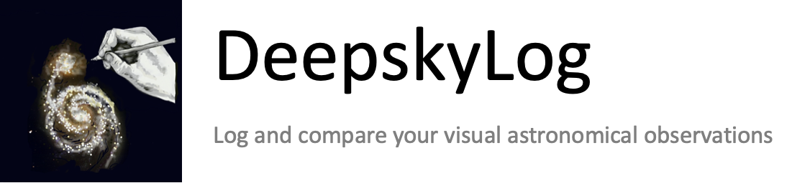

# laravel-astronomy-library

> Astronomical calculations for php / laravel

[](https://www.deepskylog.org/)

[![Latest Version on Packagist][ico-version]][link-packagist]
[![Total Downloads][ico-downloads]][link-downloads]
[![Build Status][ico-travis]][link-travis]
[![StyleCI][ico-styleci]][link-styleci]

Take a look at [contributing.md](contributing.md) if you are interesting in helping out.
The laravel-astronomy-library is part of [DeepskyLog](https://www.deepskylog.org). If you are interested in helping with the development of DeepskyLog, see the [documentation](https://github.com/DeepskyLog/DeepskyLog/blob/laravel/README.md).

## Installation

AstronomyLibrary can be installed via composer:

``` bash
composer require deepskylog/laravel-astronomy-library
```

You need to publish and run the migration:

``` bash
php artisan vendor:publish --provider="deepskylog\AstronomyLibrary\AstronomyLibraryServiceProvider" --tag="migrations"
php artisan migrate
```

The database table with the delta t values can be updated using the following command:

``` bash
php artisan deltat:update
```

A job is automatically scheduled every 4 months to update the delta t value. This job can be executed using:

``` bash
php artisan schedule:run
```

It is possible to run these jobs automatically by adding the following line to your crontab:

``` bash
* * * * * cd /path-to-your-project && php artisan schedule:run >> /dev/null 2>&1
```

## Documentation

For more documentation on the mathematical background, see [docs.md](docs/docs.md).

## Usage

```php
<?php
// Use the factory to create a AstronomyLibrary instance
$coords = new GeographicalCoordinates(-70.73330, -29.25);
$astrolib = new AstronomyLibrary($carbonDate, $coords);
```

### Time methods

```php
// Get the date of the AstronomyLibrary instance.
$date = $astrolib->getDate();

// Set a new date to the AstronomyLibrary instance.
$astrolib->setDate($carbonDate);

// Get the coordinates of the AstronomyLibrary instance.
$coords = $astrolib->getGeographicalCoordinates();

// Set the coordinates of the AstronomyLibrary instance.
$astrolib->setGeographicalCoordinates($newCoords);

// TODO: Add Equatorial, Galactic and EclipticalCoordinates
// Get the julian day of the AstronomyLibrary instance.
$jd = $astrolib->getJd();

// Set the julian day of the AstronomyLibrary instance. Also update the carbon date.
$astrolib->setJd($jd);

// Get delta t for the date of the AstronomyLibrary instance.
$deltat = $astrolib->getDeltaT();

// Get the dynamical time of the AstronomyLibrary instance.
$dynamicalTime = $astrolib->getDynamicalTime();

// Get the mean siderial time for AstronomyLibrary instance.
$meanSiderialTime = $astrolib->getMeanSiderialTime();

// Get the apparent siderial time for AstronomyLibrary instance.
$meanSiderialTime = $astrolib->getApparentSiderialTime();

// Get the nutation for the AstronomyLibrary instance.
$nutation = $astrolib->getNutation();
```

### Static Time methods

```php
// Convert from Carbon date to Julian day
$jd = Time::getJd($carbonDate);

// Convert from Julian day to Carbon date
$carbonDate = Time::fromJd($jd);

// Get delta T for the given date
$deltat = Time::deltaT($carbonDate);

// Get the dynamical time for the given date
$dynamicalTime = Time::dynamicalTime($carbonDate);

// Get the mean siderial time for the given date
$meanSiderialTime = Time::meanSiderialTime($carbonDate);

// Get the apparent siderial time for the given date
$meanSiderialTime = Time::apparentSiderialTime($carbonDate);

// Get the nutation for the given julian day
$nutation = Time::nutation($jd);
```

## Magnitude methods

### Static magnitude methods

```php
// Convert from Naked Eye Limiting Magnitude to SQM value
$sqm = Magnitude::nelmToSqm($sqm, $fstOffset);

// Convert from Naked Eye Limiting Magnitude to bortle scale
$bortle = Magnitude::nelmToBortle($sqm);

// Convert from SQM value to Naked Eye Limiting Magnitude
$nelm = Magnitude::sqmToNelm($sqm, $fstOffset);

// Convert from SQM value to bortle scale
$bortle = Magnitude::sqmToBortle($sqm);

// Convert from bortle scale to Naked Eye Limiting Magnitude
$nelm = Magnitude::bortleToNelm($bortle, $fstOffset);

// Convert from bortle scale to SQM value
$sqm = Magnitude::bortleToNelm($bortle, $fstOffset);
```

## Change log

Please see the [changelog](changelog.md) for more information on what has changed recently.

## Testing

``` bash
phpunit
```

## Contributing

Please see [contributing.md](contributing.md) for details and a todolist.

## Security

If you discover any security related issues, please email developers@deepskylog.be instead of using the issue tracker.

## Credits

- [The DeepskyLog Team][link-author]
- [All Contributors][link-contributors]

## License

GPLv3. Please see the [license file](LICENSE) for more information.

[ico-version]: https://img.shields.io/packagist/v/deepskylog/laravel-astronomy-library.svg?style=flat-square
[ico-downloads]: https://img.shields.io/packagist/dt/deepskylog/laravel-astronomy-library.svg?style=flat-square
[ico-travis]: https://img.shields.io/travis/deepskylog/laravel-astronomy-library/master.svg?style=flat-square
[ico-styleci]: https://styleci.io/repos/255550499/shield

[link-packagist]: https://packagist.org/packages/deepskylog/laravel-astronomy-library
[link-downloads]: https://packagist.org/packages/deepskylog/laravel-astronomy-library
[link-travis]: https://travis-ci.org/deepskylog/laravel-astronomy-library
[link-styleci]: https://styleci.io/repos/255550499
[link-author]: https://github.com/DeepskyLog
[link-contributors]: ../../contributors
